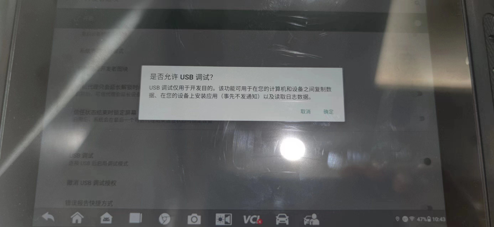

# autel_MS906_PRO_analyse

MaxiSys MS906 Pro软硬件平台全面升级，支持更多拓展功能及Autel云服务，是道通更具竞争力的新一代汽车智能诊断设备。 基于三星 Exynos八核处理器，128GB超大内存，配备8.0英寸LCD电容式触摸屏，1920*1200 超高分辨率，采用全新安卓7.0系统，结合最全的原厂级诊断车型覆盖，支持ADAS校准、电池检测等拓展功能及Autel云服务，MaxiSys MS906 Pro以其超强的实用性成为维修厂真正实现无忧诊断的性价比之王。

 

## 打开开发者模式

1、设备没有开启“开发者模式”，所以调试分析很不方便。

2、“设置” -> “关于平板电脑” -> 连续点击 “版本号” ，出现提示框，要求输入密码
 
 
3、输入解锁密码“Autel8888” ，注意区分大小写，点击确认。

4、“设置” -> “系统” -> “开发者选项”。

5、打开“USB调试”选项。

6、使用Mini USB接口，连接诊断仪上方USB接口。（注意，USB A口不行，要用MIINI USB口）

7、PC可以ADB SHELL了

## 诊断功能分析
